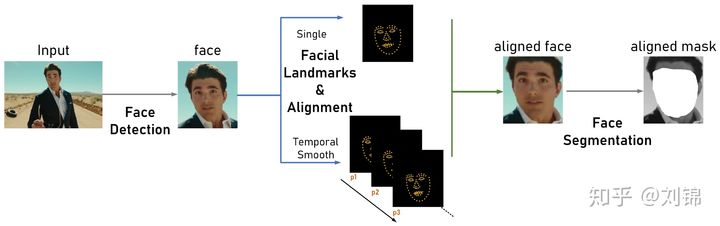
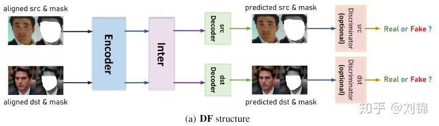
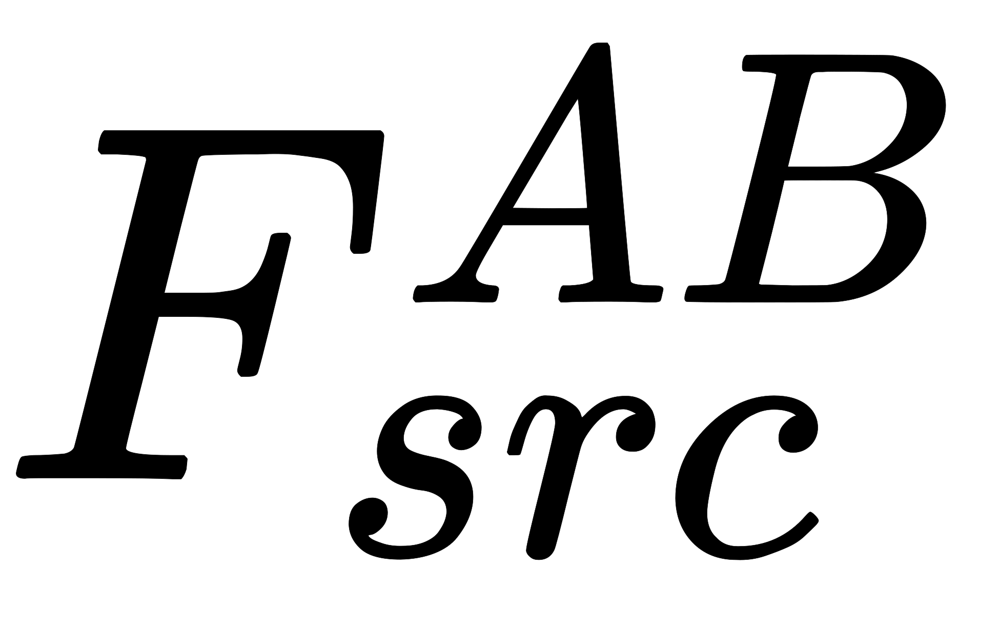
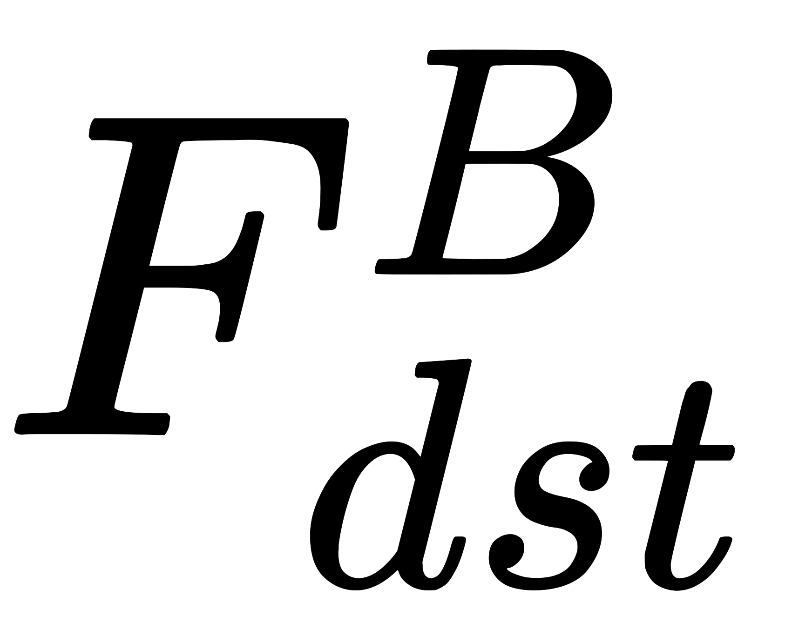
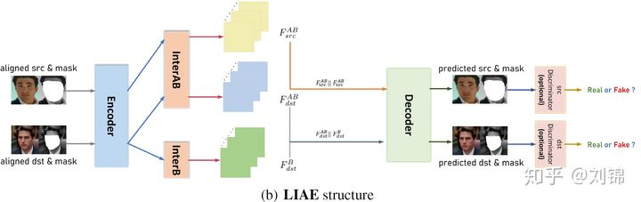

# 整体流程
换脸是一对一的，也就是训练的模型只可以将src源人脸换到dst目标人脸上	
整体pipeline分为三部分，提取、训练和转换。

## 提取模块

1. 人脸定位：
   	对源人脸和目标人脸的图像进行人脸检测，
      	也就是定位人脸bounding box，默认使用S3FD，也可以选择用RetinaFace或者MTCNN。

2. 人脸关键点检测和人脸对齐：
   	人脸关键点检测使用了2DFAN或者PRNet，前面用于正脸，后面用于侧脸。
      	人脸对齐使用了一个比较老的方法，该方法利用最小二乘来估计变换参数，最后得到人脸对齐的效果。
   
3. 人脸分割：
   	人脸分割阶段采用了人脸分割网络TernausNet，来分割出头发、眼镜、手部这些可能会对人脸的变换有影响的点。最后生成一个人脸区域的mask，用于决定最后的生成部分。

## 训练模块
训练方法大体有以下两种模型。
DF结构:
	第一种是比较传统的DF结构，与经典的deepfake结构相似，通过训练两个共享权重的Encoder和Inter，两个不同的decoder达到最终的换脸的目的。如下图所示：
	        
LIAE结构:	
	第二种是比较新颖的LIAE结构，其中Encoder和Decoder的权重是共享的，InterAB和InterB是独立的。将src图像和dst图像通过InterAB分别得到  和 ，同理得到  。然后把对应的特征拼接起来，送到后面的decoder。这么做的原因我理解的不是很清楚，原文说的是：
	

The motivation of concatenating  with   is to shift the direction of latent code in direction of the class (src or dst) we need, through which InterAB obtained a compact and well-aligned representation of src and dst in the latent space.
		我觉得是如果这么做，那么特征就有更好的方向信息，InterAB就可以更好地表达两类图像。（我也没太理解好。）

损失函数方面，使用了SSIM和和MSE对生成的图像进行约束。此外，还可以选择添加判别器来对生成的图像进行额外的约束。当对于高分辨率的图像时，每个模块的内部还会有额外的变化来满足复杂程度的需要。

